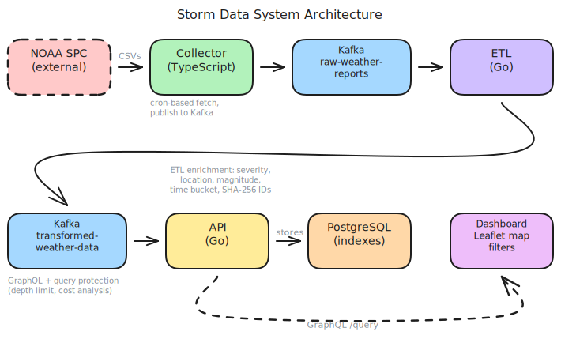

# Architecture

System design, tradeoffs, improvement roadmap, and GCP cost analysis for the storm data pipeline. For a detailed look at how data moves through the system, see [[Data Flow]]. For per-service configuration, see [[Configuration]].

## System Overview

Three services, two Kafka topics, one database. Data flows left to right. Clients query the GraphQL API on the far right.

## Design Tradeoffs

### Multi-repo over monorepo

Each service is an independent Git repository with its own CI, dependencies, and release cycle.

**Why**: Services are written in different languages (TypeScript, Go) with different toolchains. Independent repos allow independent deployments and avoid coupling release schedules. Each repo has its own Docker Compose for local development of that service in isolation.

**Tradeoff**: Cross-service changes (like adding a new field to the Kafka message schema) require coordinated PRs across repos. The `storm-data-system` repo mitigates this by providing a unified E2E test that validates the full pipeline.

**Alternative considered**: A monorepo with shared tooling. Would simplify cross-cutting changes but introduces coupling between TypeScript and Go toolchains.

### Kafka as the integration layer

Services communicate exclusively through Kafka topics. There are no synchronous service-to-service calls.

**Why**: Decouples producers from consumers. The collector can publish without knowing (or waiting for) downstream processing. The ETL can be restarted, scaled, or replaced without affecting the collector. Kafka provides durability, replay capability, and natural backpressure.

**Tradeoff**: Added infrastructure complexity. Kafka requires careful configuration (replication, retention, partitioning) and consumes significant memory (~512MB--1GB). For the current data volume (hundreds of records per day), this is overprovisioned.

**Alternative considered**: Direct HTTP calls between services, or a simpler queue like Redis Streams. Would reduce infrastructure but sacrifice decoupling and replay capability.

### At-least-once delivery

The ETL and API consumers use manual offset commits. Offsets are committed only after successful processing and writing.

**Why**: Prevents data loss. If a consumer crashes mid-processing, the message is redelivered on restart.

**Tradeoff**: Duplicate processing is possible. The API handles this with `INSERT ... ON CONFLICT (id) DO NOTHING` using deterministic IDs (SHA-256 hash of type+state+lat+lon+time). The ETL's transform is stateless and idempotent, so duplicates produce identical output.

### Deterministic IDs

Event IDs are SHA-256 hashes of `type|state|lat|lon|time`. The same raw event always produces the same ID.

**Why**: Enables idempotent writes at every stage. The API's upsert (`ON CONFLICT DO NOTHING`) naturally deduplicates. No distributed ID generation needed.

**Tradeoff**: Two genuinely different events with identical type, state, coordinates, and timestamp would collide. In practice, NOAA data has sufficient uniqueness in these fields. Adding the `Comments` field to the hash would reduce collision risk at the cost of sensitivity to comment edits.

### Cron-based collection

The collector fetches NOAA CSVs on a schedule (daily by default) rather than streaming in real time.

**Why**: NOAA publishes daily CSV files, not a real-time stream. A cron schedule matches the data source's cadence. The collector also runs once immediately on startup for faster feedback during development.

**Tradeoff**: Data freshness is limited to the cron interval. For storm data used in analysis (not real-time alerting), daily collection is sufficient.

### Hexagonal architecture in ETL

The ETL service defines `Extractor`, `Transformer`, and `Loader` interfaces. Kafka adapters implement these interfaces, and the pipeline orchestrates them.

**Why**: Domain logic (parsing, enrichment, severity classification) is completely isolated from infrastructure. Tests can substitute in-memory implementations. The Kafka consumer could be swapped for a file reader or HTTP endpoint without touching business logic.

**Tradeoff**: More files and indirection for what is essentially a single pipeline. For a small service, this is arguably over-engineered. The payoff comes when adding new enrichment steps or swapping infrastructure.

### Schema-first GraphQL (gqlgen)

The API defines the GraphQL schema in `.graphqls` files and generates Go code from it.

**Why**: The schema is the contract. Frontend developers can read the schema without understanding Go. Code generation eliminates boilerplate and ensures the implementation matches the schema.

**Tradeoff**: Schema changes require running `go generate`, and the generated code can be verbose. Runtime reflection-based approaches (like graphql-go) are more flexible but lose compile-time safety.

### Poison pill handling

The ETL skips malformed messages (logs a warning, commits the offset, continues). The API does the same.

**Why**: A single bad message should not block the entire pipeline. Logging the error provides visibility for investigation.

**Tradeoff**: Silently skipping messages can hide data quality issues. A dead letter queue (DLQ) would be better -- see improvements below.

For the complete data model and message shapes at each stage, see [[Data Model]]. For observability across all services, see [[Observability]].

## Improvements

### Near-term

**Schema registry** -- Introduce Avro or Protobuf schemas with a Confluent Schema Registry (or Buf). Currently the Kafka message format is an implicit JSON contract. A schema registry would catch breaking changes at publish time rather than at consumer parse time.

**OpenTelemetry tracing** -- Add distributed tracing across all three services. Each Kafka message would carry a trace context header, enabling end-to-end latency visualization. GCP Cloud Trace provides a managed backend.

**Alerting on data lag** -- The API already exposes `dataLagMinutes` via GraphQL. Add Prometheus alerting rules for when data lag exceeds a threshold (e.g., 2 hours during storm season).

### Medium-term

**Batch processing in ETL** -- Currently processes one message at a time. Batching (e.g., 100 messages per commit) would improve throughput significantly. The Kafka writer already supports batch writes.

**Connection pooling for Mapbox** -- The optional geocoding enrichment makes one HTTP call per event. A connection pool, circuit breaker, and rate limiter would improve resilience when geocoding is enabled.

**PostgreSQL partitioning** -- Partition the `storm_reports` table by `begin_time` (monthly or yearly). This would improve query performance for time-range filters and simplify data retention.

**GraphQL subscriptions** -- Add WebSocket-based subscriptions so clients can receive real-time updates when new storm reports are ingested. gqlgen supports subscriptions natively.

### Long-term

**Real-time ingestion** -- If NOAA provides a streaming API in the future, replace cron-based collection with a persistent connection. The Kafka-based architecture already supports this -- only the collector would change.

**Multi-region deployment** -- Deploy the API to multiple GCP regions with Cloud SQL read replicas for lower latency. Kafka MirrorMaker 2 could replicate topics across regions.

**ML enrichment** -- Add a machine learning step to the ETL pipeline for damage estimation, storm path prediction, or severity classification beyond the current rule-based approach.

## GCP Cloud Cost Analysis

Cost estimates for running the storm data pipeline on Google Cloud Platform. NOAA storm data is low volume (hundreds to low thousands of records per day during storm season), so the workload is lightweight.

### Architecture Options

#### Option A: Cloud Run + Managed Services (Recommended)

Best for low-to-moderate traffic. Pay-per-use, scales to zero, minimal operations.

| Component              | GCP Service                    | Spec                          | Monthly Cost |
| ---------------------- | ------------------------------ | ----------------------------- | ------------ |
| Collector              | Cloud Run                      | 1 vCPU, 512MB, cron trigger  | $1--5        |
| ETL                    | Cloud Run                      | 1 vCPU, 512MB, always-on     | $5--15       |
| API                    | Cloud Run                      | 1 vCPU, 512MB, autoscale 0-3 | $5--20       |
| Kafka                  | Confluent Cloud (Basic)        | 1 CKU, 2 topics, low throughput | $50--100  |
| PostgreSQL             | Cloud SQL (PostgreSQL 16)      | db-f1-micro, 10GB SSD        | $10--15      |
| Container Registry     | Artifact Registry              | 3 images, ~200MB each        | $1--2        |
| CI/CD                  | Cloud Build                    | 120 min/day free tier         | $0--5        |
| Monitoring             | Cloud Monitoring               | Free tier + custom metrics    | $0--10       |
| Scheduler              | Cloud Scheduler                | Cron trigger for collector    | $0           |
| **Total**              |                                |                               | **$72--172** |

**Notes**:

- Cloud Run bills per 100ms of CPU time. The collector runs once daily (seconds of compute). The ETL and API are lightweight.
- Confluent Cloud Basic tier is the largest cost. Self-managed Kafka on a small GKE node ($25--50/month) would save money but add operational burden.
- Cloud SQL db-f1-micro (0.6GB RAM, shared vCPU) is sufficient for this data volume. Upgrade to db-custom-1-3840 (~$30/month) if query latency matters.

#### Option B: GKE Autopilot

Better for teams already on Kubernetes. More control, but higher base cost.

| Component              | GCP Service                    | Spec                          | Monthly Cost |
| ---------------------- | ------------------------------ | ----------------------------- | ------------ |
| GKE Autopilot          | GKE                            | Base fee + pod costs          | $75--120     |
| Kafka (self-managed)   | KRaft on GKE                   | 1 broker, 1GB RAM, 10GB disk | $0 (pod cost included) |
| PostgreSQL             | Cloud SQL (PostgreSQL 16)      | db-f1-micro, 10GB SSD        | $10--15      |
| Container Registry     | Artifact Registry              | 3 images                      | $1--2        |
| Load Balancer          | GKE Ingress                    | 1 forwarding rule             | $18--20      |
| **Total**              |                                |                               | **$104--157** |

**Notes**:

- GKE Autopilot charges $0.0445/vCPU-hour and $0.0049225/GB-hour for pod resources.
- Self-managing Kafka on GKE eliminates the Confluent Cloud cost but requires monitoring ZooKeeper/KRaft, brokers, and disk.
- Better suited if you plan to add more services or need fine-grained resource control.

#### Option C: Pub/Sub Instead of Kafka

Lowest cost and operational burden. Replaces Kafka with GCP-native messaging.

| Component              | GCP Service                    | Spec                          | Monthly Cost |
| ---------------------- | ------------------------------ | ----------------------------- | ------------ |
| Collector              | Cloud Run                      | Cron-triggered                | $1--5        |
| ETL                    | Cloud Run                      | Pub/Sub push subscription     | $5--15       |
| API                    | Cloud Run                      | Pub/Sub push + GraphQL        | $5--20       |
| Messaging              | Cloud Pub/Sub                  | 2 topics, low throughput      | $0--5        |
| PostgreSQL             | Cloud SQL (PostgreSQL 16)      | db-f1-micro, 10GB SSD        | $10--15      |
| Container Registry     | Artifact Registry              | 3 images                      | $1--2        |
| **Total**              |                                |                               | **$22--62**  |

**Notes**:

- Cloud Pub/Sub's free tier covers 10GB/month of messaging. Storm data is well under this.
- Requires refactoring the Kafka producers/consumers to use Pub/Sub client libraries. The hexagonal architecture in the ETL makes this straightforward (swap the Kafka adapter for a Pub/Sub adapter).
- Loses Kafka features: consumer groups with partition assignment, exactly-once semantics, log compaction, replay from offset.

### Cost Optimization Tips

- **Cloud Run min-instances=0** -- All services can scale to zero during off-season (November--March) when storm data volume drops significantly.
- **Cloud SQL shared-core** -- The db-f1-micro instance is ~$7/month. Only upgrade if query latency becomes an issue.
- **Committed use discounts** -- 1-year or 3-year commitments on Cloud SQL reduce costs by 25--52%.
- **Confluent Cloud vs self-managed** -- If Confluent Cloud ($50--100/month) dominates cost, consider self-managing Kafka on a small Compute Engine instance ($15--25/month) or switching to Pub/Sub.
- **Artifact Registry cleanup** -- Set lifecycle policies to delete untagged images after 7 days.
- **Regional vs multi-region** -- Deploy everything in a single region (e.g., `us-central1`) to avoid cross-region data transfer costs.

### Recommendation

**Start with Option A (Cloud Run + Confluent Cloud Basic)** at ~$72--172/month. This minimizes operational overhead while keeping the Kafka-based architecture intact. If cost becomes a concern, migrate from Confluent Cloud to self-managed Kafka or Pub/Sub (Option C) to bring costs under $60/month.

For a team evaluating the pipeline before committing to production, the free tiers of Cloud Run, Cloud Build, and Cloud Monitoring cover most services. The primary costs are Kafka ($50--100) and Cloud SQL ($10--15).
