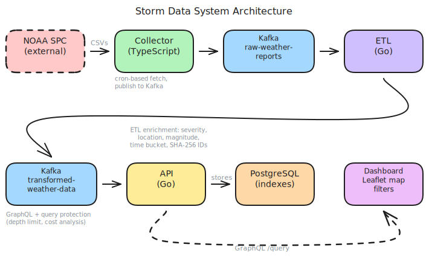

# Architecture

System design, tradeoffs, and improvement roadmap for the storm data pipeline.

## System Overview



Three services, two Kafka topics, one database. Data flows left to right through a collector → ETL → API pipeline. Clients query the GraphQL API on the far right.

## Deployment Topology

The system runs on a local Kubernetes cluster (minikube) with resources spread across two namespaces.

### Namespaces

**`kafka`** -- Strimzi operator and all Kafka-related custom resources (Kafka cluster, KafkaNodePool, KafkaTopic). Strimzi requires its operator and managed resources in the same namespace for RBAC scoping.

**`hailtrace`** -- All application workloads (collector, ETL, API, mock server, dashboard), PostgreSQL, Prometheus, and Kafka UI. Services reference the Kafka broker via its cross-namespace DNS name: `kafka-kafka-bootstrap.kafka.svc.cluster.local:9092`.

### Kubernetes Resources

| Resource | Kind | Namespace | Description |
|----------|------|-----------|-------------|
| `kafka` | Kafka (Strimzi CR) | kafka | Single-node KRaft-mode Kafka 4.1.1 cluster |
| `broker` | KafkaNodePool (Strimzi CR) | kafka | Broker pool: 1 replica, broker+controller roles, 1Gi PVC |
| `raw-weather-reports` | KafkaTopic (Strimzi CR) | kafka | 1 partition, 1 replica |
| `transformed-weather-data` | KafkaTopic (Strimzi CR) | kafka | 1 partition, 1 replica |
| `postgres` | StatefulSet | hailtrace | PostgreSQL 16, 1 replica, 1Gi PVC, headless Service |
| `postgres-credentials` | Secret | hailtrace | POSTGRES_USER, POSTGRES_PASSWORD, POSTGRES_DB |
| `collector` | Deployment | hailtrace | 1 replica, ConfigMap for Kafka/URL config |
| `etl` | Deployment | hailtrace | 1 replica, ConfigMap for Kafka topics and batch config |
| `api` | Deployment | hailtrace | 1 replica, ConfigMap + Secret (DATABASE_URL) |
| `mock-server` | Deployment | hailtrace | 1 replica, local image (imagePullPolicy: Never) |
| `dashboard` | Deployment | hailtrace | nginx serving HTML from ConfigMap volume |
| `prometheus` | Deployment | hailtrace | Scrapes collector, ETL, and API /metrics endpoints |
| `kafka-ui` | Deployment | hailtrace | Web UI for topic inspection |

Each Deployment has a corresponding ClusterIP Service for in-cluster DNS resolution. PostgreSQL uses a headless Service (`clusterIP: None`) for stable pod DNS (`postgres-0.postgres.hailtrace.svc`).

### Strimzi Operator Pattern

Kafka is managed by the [Strimzi operator](https://strimzi.io/) rather than raw StatefulSets. The operator watches for `Kafka`, `KafkaNodePool`, and `KafkaTopic` custom resources and reconciles the actual Kafka broker pods, storage, and topic configuration.

This replaces the `kafka-init` container from the Docker Compose setup. Previously, an init container ran `kafka-topics.sh --create` on startup to ensure topics existed. Now, topics are declared as `KafkaTopic` CRs in `k8s/base/kafka/`, and Strimzi's entity operator creates and manages them. Adding a topic means adding a YAML file, not modifying a startup script.

The Strimzi-managed Kafka runs in KRaft mode (no ZooKeeper) with a single combined broker/controller node. The bootstrap service is exposed at `kafka-kafka-bootstrap.kafka.svc.cluster.local:9092` -- the naming convention is `{cluster-name}-kafka-bootstrap`.

### Kustomize Base/Overlay Structure

Manifests are organized using [Kustomize](https://kustomize.io/), which is built into kubectl:

- **`k8s/base/`** -- Canonical resource definitions for all hailtrace-namespace workloads. The base `kustomization.yaml` assembles Postgres, application services, monitoring, dashboard, and Kafka UI. Kafka resources (in `k8s/base/kafka/`) are applied separately to the kafka namespace via the Makefile.

- **`k8s/overlays/dev/`** -- Development overlay. Patches the mock-server Deployment to use a locally-built image with `imagePullPolicy: Never`, loaded into minikube's Docker daemon via `eval $(minikube docker-env)`.

- **`k8s/overlays/ci/`** -- CI overlay. Pins the three application service images (collector, ETL, API) to their published Docker Hub tags. This is the Kustomize equivalent of the former `compose.ci.yml` override.

The base/overlay split replaces Docker Compose's file override pattern (`docker compose -f compose.yml -f compose.ci.yml`). Environment-specific changes are expressed as Kustomize patches rather than Compose file merges.

## Design Tradeoffs

### Multi-repo over monorepo

Each service is an independent Git repository with its own CI, dependencies, and release cycle.

**Why**: Services are written in different languages (TypeScript, Go) with different toolchains. Independent repos allow independent deployments and avoid coupling release schedules. Each repo has its own Docker Compose for local development of that service in isolation.

**Tradeoff**: Cross-service changes (like adding a new field to the Kafka message schema) require coordinated PRs across repos. The `storm-data-system` repo mitigates this by providing a unified E2E test that validates the full pipeline.

**Alternative considered**: A monorepo with shared tooling. Would simplify cross-cutting changes but introduces coupling between TypeScript and Go toolchains.

### Kafka as the integration layer

Services communicate exclusively through Kafka topics. There are no synchronous service-to-service calls.

**Why**: Decouples producers from consumers. The collector can publish without knowing (or waiting for) downstream processing. The ETL can be restarted, scaled, or replaced without affecting the collector. Kafka provides durability, replay capability, and natural backpressure.

**Tradeoff**: Added infrastructure complexity. Kafka requires careful configuration (replication, retention, partitioning) and consumes significant memory (~512MB--1GB). For the current data volume (hundreds of records per day), this is overprovisioned.

**Alternative considered**: Direct HTTP calls between services, or a simpler queue like Redis Streams. Would reduce infrastructure but sacrifice decoupling and replay capability.

### At-least-once delivery

The ETL and API consumers use manual offset commits. Offsets are committed only after successful processing and writing.

**Why**: Prevents data loss. If a consumer crashes mid-processing, the message is redelivered on restart.

**Tradeoff**: Duplicate processing is possible. The API handles this with `INSERT ... ON CONFLICT (id) DO NOTHING` using deterministic IDs (SHA-256 hash of event_type+state+lat+lon+time+magnitude). The ETL's transform is stateless and idempotent, so duplicates produce identical output.

### Deterministic IDs

Event IDs are SHA-256 hashes of `event_type|state|lat|lon|time|magnitude`. The same raw event always produces the same ID.

**Why**: Enables idempotent writes at every stage. The API's upsert (`ON CONFLICT DO NOTHING`) naturally deduplicates. No distributed ID generation needed.

**Tradeoff**: Two genuinely different events with identical event type, state, coordinates, timestamp, and magnitude would collide. In practice, NOAA data has sufficient uniqueness in these fields. Adding the `Comments` field to the hash would reduce collision risk at the cost of sensitivity to comment edits.

### Cron-based collection

The collector fetches NOAA CSVs on a schedule (daily by default) rather than streaming in real time.

**Why**: NOAA publishes daily CSV files, not a real-time stream. A cron schedule matches the data source's cadence. The collector also runs once immediately on startup for faster feedback during development.

**Tradeoff**: Data freshness is limited to the cron interval. For storm data used in analysis (not real-time alerting), daily collection is sufficient.

### Hexagonal architecture in ETL

The ETL service defines `BatchExtractor`, `Transformer`, and `BatchLoader` interfaces. Kafka adapters implement these interfaces, and the pipeline orchestrates them.

**Why**: Domain logic (parsing, enrichment, severity classification) is completely isolated from infrastructure. Tests can substitute in-memory implementations. The Kafka consumer could be swapped for a file reader or HTTP endpoint without touching business logic.

**Tradeoff**: More files and indirection for what is essentially a single pipeline. For a small service, this is arguably over-engineered. The payoff comes when adding new enrichment steps or swapping infrastructure.

### Schema-first GraphQL (gqlgen)

The API defines the GraphQL schema in `.graphqls` files and generates Go code from it.

**Why**: The schema is the contract. Frontend developers can read the schema without understanding Go. Code generation eliminates boilerplate and ensures the implementation matches the schema.

**Tradeoff**: Schema changes require running `go generate`, and the generated code can be verbose. Runtime reflection-based approaches (like graphql-go) are more flexible but lose compile-time safety.

### Poison pill handling

The ETL skips malformed messages (logs a warning, commits the offset, continues). The API does the same.

**Why**: A single bad message should not block the entire pipeline. Logging the error provides visibility for investigation.

**Tradeoff**: Silently skipping messages can hide data quality issues. A dead letter queue (DLQ) would be better -- see improvements below.

For the complete data model and message shapes at each stage, see the ETL [Enrichment](https://github.com/couchcryptid/storm-data-etl/wiki/Enrichment) rules and the API [Architecture](https://github.com/couchcryptid/storm-data-api/wiki/Architecture) database schema.

## Improvements

Ingest volume is low (hundreds of records per day during storm season). The collector and ETL are massively overprovisioned and don't need to scale. The improvements below focus on the surfaces that matter: API query performance, storage scalability, and developer experience.

### Near-term

**Schema registry** -- Introduce Avro or Protobuf schemas with a Confluent Schema Registry (or Buf). Currently the Kafka message format is an implicit JSON contract between three repos. A schema registry would catch breaking changes at publish time rather than at consumer parse time.

**OpenTelemetry tracing** -- Add distributed tracing across all three services. Each Kafka message would carry a trace context header, enabling end-to-end latency visualization from ingest to query response.

**Alerting on data lag** -- The API already exposes `dataLagMinutes` via GraphQL. Add Prometheus alerting rules for when data lag exceeds a threshold (e.g., 2 hours during storm season).

### Medium-term

**API response caching** -- Add an in-memory or Redis cache in front of PostgreSQL for frequently-queried time ranges and aggregations. Storm data is append-only, so cache invalidation only needs to happen on new ingestion batches. This is the first scaling lever for the read-heavy API workload.

### Long-term

**Read replicas** -- Add PostgreSQL read replicas to scale query throughput. The API's read-heavy workload (GraphQL queries) is a natural fit for read replicas, while the single writer (Kafka consumer) continues targeting the primary.

**PostgreSQL partitioning** -- Partition the `storm_reports` table by `event_time` (monthly or yearly). At current ingest rates the dataset grows slowly and existing indexes handle query performance well. Partitioning becomes relevant if retention spans many years or query patterns shift toward large time-range scans.

**GraphQL subscriptions** -- Add WebSocket-based subscriptions so clients can receive updates when new storm reports are ingested. gqlgen supports subscriptions natively. The current data cadence is daily batch collection, so subscriptions would primarily benefit workflows that poll for fresh data after each ingest cycle rather than true real-time streaming.

**Vector tile serving** -- The current query layer (dynamic filters, bounding box pre-filter, attribute filtering) is structurally similar to a vector tile server's per-tile spatial query. Migrating to PostGIS (see Haversine scaling note above) would enable `ST_AsMVT` for native Mapbox Vector Tile generation directly from SQL:

```sql
SELECT ST_AsMVT(tile, 'storms')
FROM (
  SELECT ST_AsMVTGeom(geom, ST_TileEnvelope(z, x, y)) AS geom,
         event_type, severity, magnitude
  FROM storm_reports
  WHERE geom && ST_TileEnvelope(z, x, y)
    AND event_type = ANY($1)
    AND event_time BETWEEN $2 AND $3
) AS tile
```

The existing `querybuilder.go` filter logic would translate to tile-coordinate bounding boxes (z/x/y → lat/lon envelope) with the same attribute filters. Client-side rendering (Mapbox GL JS or MapLibre) would replace server-side serialization, offloading geometry rendering to the browser's GPU. For user-defined filter criteria, the GraphQL API could accept filter definitions and return tile endpoint URLs, keeping the schema-first contract while enabling dynamic map layers.

In production, vector tile serving would likely be a dedicated service — tile rendering has different scaling and caching characteristics (bursty tile requests on pan/zoom, aggressive CDN cacheability) than the GraphQL data API. The spatial query patterns and filter logic from the API would transfer directly, with shared components (config, observability, health endpoints) pulled from `storm-data-shared`.

**ML enrichment** -- Exploratory. The current rule-based severity classification serves existing use cases well. A machine learning step in the ETL pipeline (damage estimation, storm path prediction, or severity classification beyond thresholds) could add value but is not driven by a current user need. Worth revisiting if the dataset or user base grows to warrant it.

## Related

- [Collector Architecture](https://github.com/couchcryptid/storm-data-collector/wiki/Architecture) -- CSV fetching, retry strategy, and Kafka publishing
- [ETL Architecture](https://github.com/couchcryptid/storm-data-etl/wiki/Architecture) -- hexagonal design, enrichment pipeline, and offset strategy
- [API Architecture](https://github.com/couchcryptid/storm-data-api/wiki/Architecture) -- GraphQL resolvers, store layer, and query protection
- [Shared Architecture](https://github.com/couchcryptid/storm-data-shared/wiki/Architecture) -- package design and interface contracts
- [[Development]] -- running the stack, E2E tests, and conventions
