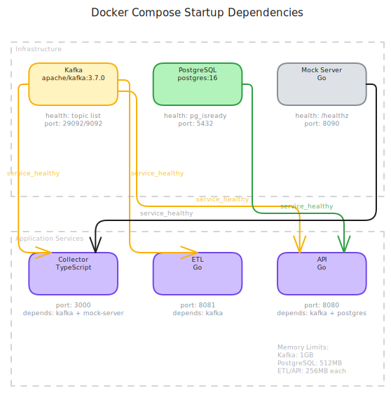

# Deployment

How to run the complete storm data stack. The unified Docker Compose in this repository brings up all three services, Kafka, PostgreSQL, and a mock NOAA server for testing.

For per-service Docker details, see each service's wiki:

- [Collector Deployment](https://github.com/couchcryptid/storm-data-collector/wiki/Deployment)
- [ETL Deployment](https://github.com/couchcryptid/storm-data-etl/wiki/Deployment)
- [API Deployment](https://github.com/couchcryptid/storm-data-api/wiki/Deployment)

## Local Development (Build from Source)

Builds all service images from the sibling repos and starts the full stack:

```sh
make up
```

### Prerequisites

- Docker and Docker Compose
- Sibling repos cloned alongside this repo:

```
~/Projects/hailtrace/
  storm-data-collector/
  storm-data-etl/
  storm-data-api/
  storm-data-system/          <-- this repo
```

### Services

| Service | Image / Build | Host Port | Internal Port | Health Check |
|---------|--------------|-----------|---------------|--------------|
| `kafka` | `apache/kafka:3.7.0` | 29092 | 9092 | Topic list |
| `postgres` | `postgres:16` | 5432 | 5432 | `pg_isready` |
| `mock-server` | `./mock-server` | 8090 | 8080 | `/healthz` |
| `collector` | `../storm-data-collector` | 3000 | 3000 | `/healthz` |
| `etl` | `../storm-data-etl` | 8081 | 8080 | `/healthz` |
| `api` | `../storm-data-api` | 8080 | 8080 | `/healthz` |
| `dashboard` | `nginx:1-alpine` | 8000 | 80 | HTTP GET `/` |
| `prometheus` | `prom/prometheus:v3.2.1` | 9090 | 9090 | `promtool check healthy` |
| `kafka-ui` | `provectuslabs/kafka-ui:latest` | 8082 | 8080 | `/actuator/health` |

### Startup Order



Docker Compose health checks enforce dependency ordering:

All services use `restart: unless-stopped`. The `--wait` flag in `make up` blocks until all health checks pass.

### Resource Limits

| Service | Memory Limit | Memory Reservation |
|---------|--------------|--------------------|
| Kafka | 1 GB | 512 MB |
| PostgreSQL | 512 MB | 256 MB |
| ETL | 256 MB | 128 MB |
| API | 256 MB | 128 MB |

### Commands

```sh
make up              # Start full stack (build from source)
make down            # Stop and remove containers
make clean           # Stop, remove containers + volumes
make build           # Build all images without starting
make ps              # Show running services
make logs            # Tail all service logs
make logs-collector  # Tail collector logs
make logs-etl        # Tail ETL logs
make logs-api        # Tail API logs
```

## CI (Published Images)

For CI environments where service images are published to Docker Hub:

```sh
make up-ci
```

This uses `compose.ci.yml` to override `build:` directives with `image:` references:

```yaml
services:
  collector:
    image: brendanvinson/storm-data-collector:latest
  etl:
    image: brendanvinson/storm-data-etl:latest
  api:
    image: brendanvinson/storm-data-api:latest
```

### CI Workflow

```sh
docker compose -f compose.yml -f compose.ci.yml up -d --wait
cd e2e && go test -v -count=1 -timeout 5m ./...
docker compose -f compose.yml -f compose.ci.yml down -v
```

## Docker Images

All three application services use multi-stage Docker builds for minimal production images.

### Collector (TypeScript)

Five-stage build: `deps` -> `development` -> `builder` -> `prod-deps` -> `runner`. Final image is `node:24-alpine` running as non-root `appuser`.

### ETL (Go)

Two-stage build: `golang:1.25-alpine` -> `gcr.io/distroless/static-debian12`. Final image contains only the binary and CA certificates.

### API (Go)

Two-stage build: `golang:1.25-alpine` -> `gcr.io/distroless/static-debian12:nonroot`. Includes `busybox-static` for health check `wget`.

### Mock Server (Go)

Two-stage build: `golang:1.24-alpine` -> `gcr.io/distroless/static-debian12:nonroot`. Includes `busybox-static` for health checks and bundled CSV fixture data.

## Kafka Configuration

The stack runs Apache Kafka 3.7.0 in KRaft mode (no ZooKeeper). Configuration is in `.env.kafka`:

| Setting | Value | Purpose |
|---------|-------|---------|
| `KAFKA_PROCESS_ROLES` | `broker,controller` | Single-node combined mode |
| `KAFKA_LISTENERS` | Internal (9092), Host (29092), Controller (9093) | Three listener types |
| `KAFKA_ADVERTISED_LISTENERS` | `kafka:9092` (internal), `localhost:29092` (host) | Container-to-container + host access |
| `KAFKA_OFFSETS_TOPIC_REPLICATION_FACTOR` | `1` | Single-node replication |

Services within Docker use `kafka:9092` (internal PLAINTEXT). Host tools use `localhost:29092`.

## Production

See [[Architecture]] for the improvement roadmap. For production, replace the mock NOAA server with the real NOAA SPC URL via `REPORTS_BASE_URL`.

## Related

- [Collector Deployment](https://github.com/couchcryptid/storm-data-collector/wiki/Deployment) -- collector Docker image and compose config
- [ETL Deployment](https://github.com/couchcryptid/storm-data-etl/wiki/Deployment) -- ETL Docker image and compose config
- [API Deployment](https://github.com/couchcryptid/storm-data-api/wiki/Deployment) -- API Docker image and compose config
- [[Configuration]] -- environment variables across all services
- [[Development]] -- prerequisites and multi-repo workflow
- [[Demo]] -- running and exploring the stack
