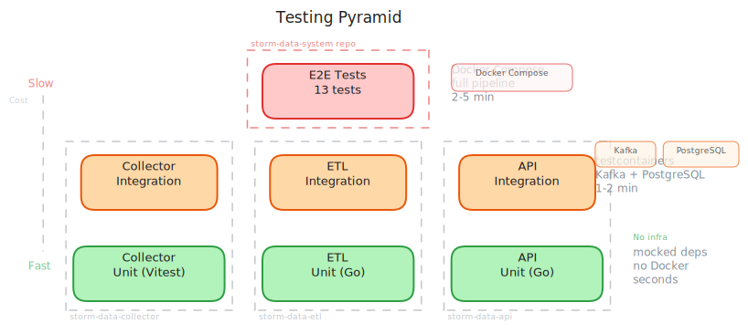

# Testing

Testing strategy for the storm data pipeline. Tests are organized in three tiers: unit tests within each service, integration tests using testcontainers, and end-to-end tests validating the full pipeline.

## Testing Pyramid



## Unit Tests

Fast, isolated tests with mocked dependencies. No Docker or external services required.

### Collector (TypeScript)

```sh
cd storm-data-collector
npm run test:unit
```

- Located in `src/**/*.test.ts` (excluding `*.integration.test.ts`)
- Uses Vitest with mocked Kafka, HTTP, and cron dependencies
- Coverage via `@vitest/coverage-v8`

### ETL (Go)

```sh
cd storm-data-etl
make test-unit    # go test ./... -count=1 -race
```

- Co-located `_test.go` files (idiomatic Go)
- Tests transformation logic, severity classification, location parsing, time bucketing
- Uses `clockwork` for deterministic time in tests
- Mock data in `data/mock/`

### API (Go)

```sh
cd storm-data-api
make test-unit    # go test ./internal/... -count=1 -race
```

- Tests model deserialization, enum validation, sort field behavior
- Mock data in `data/mock/` (271 reports: 79 hail, 149 tornado, 43 wind)
- No infrastructure dependencies

## Integration Tests

Test each service against real infrastructure using [testcontainers](https://testcontainers.com/).

### Collector

```sh
cd storm-data-collector
npm run test:integration
```

- Spins up real Kafka via testcontainers-node
- Starts a local HTTP mock server with test CSV data
- Verifies full CSV fetch -> parse -> batch publish -> Kafka consume cycle
- ~60-90 seconds to start containers

### ETL

```sh
cd storm-data-etl
make test-integration    # go test -tags=integration ./internal/integration/...
```

- Uses testcontainers-go for Kafka
- Tests the full extract -> transform -> load pipeline with real Kafka messages
- Uses `integration` build tag to separate from unit tests

### API

```sh
cd storm-data-api
make test-integration    # go test -tags=integration ./internal/integration/...
```

- Uses testcontainers-go for PostgreSQL and Kafka
- Tests store operations (insert, query, filter, aggregate, pagination)
- Tests GraphQL endpoint with real database
- Tests Kafka consumer integration (produce -> consume -> insert -> verify)
- ~1-2 minutes to start containers

### Container Images Used

| Service | Kafka Image | PostgreSQL Image |
|---------|-------------|------------------|
| Collector | KafkaJS testcontainers | -- |
| ETL | `apache/kafka:3.7.0` | -- |
| API | `confluentinc/confluent-local:7.6.0` | `postgres:16` |

Note: The API uses the Confluent Kafka image for integration tests because the testcontainers Kafka module requires Confluent's startup scripts.

## End-to-End Tests

System-level tests in this repository that validate the full pipeline using Docker Compose.

### Running

```sh
cd storm-data-system
make test-e2e        # Start stack + run tests
make test-e2e-only   # Run against already-running stack
```

### Architecture

The E2E tests run against the live Docker Compose stack:

```
Mock Server (CSV) --> Collector --> Kafka (raw) --> ETL --> Kafka (enriched) --> API --> PostgreSQL
                                                                                         |
                                                                                    E2E Tests
                                                                                  (GraphQL queries)
```

1. **Mock server** serves NOAA-format CSV fixtures over HTTP
2. **Collector** fetches CSVs on startup, publishes raw JSON to Kafka
3. **ETL** enriches events, produces to downstream topic
4. **API** consumes, persists to PostgreSQL, serves GraphQL
5. **E2E tests** query the GraphQL API to verify end-to-end correctness

### Data Propagation Gate

Tests use a `sync.Once` pattern to poll the GraphQL API until all 271 records appear (up to 120 seconds), then run assertions. This avoids flaky timing-dependent tests.

```go
func ensureDataPropagated(t *testing.T) {
    dataReady.Do(func() {
        // Poll until 271 records appear or timeout
    })
}
```

### Test Suite

| Test | What It Verifies |
|------|-----------------|
| `TestServicesHealthy` | All services respond to `/healthz` |
| `TestDataPropagation` | Data flows through the full pipeline (271 records) |
| `TestReportCounts` | 79 hail + 149 tornado + 43 wind via `byType` aggregation |
| `TestStateAggregations` | State and county breakdowns match expected counts |
| `TestReportEnrichment` | All reports have ID, unit, timeBucket, processedAt, geo |
| `TestSpotCheckHailReport` | San Saba TX hail: magnitude=1.25, unit=in, sourceOffice=SJT |
| `TestHourlyAggregation` | Hourly bucket counts sum to totalCount |
| `TestEventTypeFilter` | Filtering by `tornado` returns only tornado reports |
| `TestMeta` | `lastUpdated` and `dataLagMinutes` are populated |
| `TestPagination` | Limit/offset pagination returns distinct pages |
| `TestSeverityFilter` | Filtering by severity narrows results correctly |
| `TestSortByMagnitude` | Reports sort descending by magnitude |
| `TestGeoRadiusFilter` | Geo radius filter returns nearby reports only |

### Test Fixtures

CSV files in `mock-server/data/` follow the NOAA naming format `{YYMMDD}_rpts_{type}.csv`. The mock dataset is real NOAA SPC data from April 26, 2024:

| File | Records | Description |
|------|---------|-------------|
| `240426_rpts_hail.csv` | 79 | Hail reports |
| `240426_rpts_torn.csv` | 149 | Tornado reports |
| `240426_rpts_wind.csv` | 43 | Wind reports |

Total: **271 records** across **11 states**.

### Environment Overrides

Tests default to `localhost` URLs. Override for non-standard ports:

| Variable | Default |
|----------|---------|
| `API_URL` | `http://localhost:8080` |
| `COLLECTOR_URL` | `http://localhost:3000` |
| `ETL_URL` | `http://localhost:8081` |

## User Acceptance Tests (UAT)

Playwright tests in `uat/` that validate the dashboard UI against the live Docker Compose stack. These tests exercise the full user experience: map rendering, event filtering, timeline interaction, and GraphQL query display.

### Running

```sh
cd storm-data-system
make test-uat        # Start stack + run tests
make test-uat-only   # Run against already-running stack
```

### What They Cover

- Dashboard loads and displays the map with storm event markers
- Event type filters (hail, tornado, wind) toggle correctly
- Severity and state filters narrow results
- Timeline displays hourly aggregation data
- Expandable GraphQL query panel shows the raw query
- Report count and data summary match expected mock data

### Prerequisites

- Node.js (for `npx playwright`)
- Running stack (`make up`)
- Playwright browsers installed (`npx playwright install`)

### CI Integration

UAT tests run in the `e2e.yml` workflow after E2E tests pass. The workflow installs Playwright browsers and runs against the Docker Compose stack with published images.

## Coverage

### Collector

```sh
npm run test:coverage         # All tests
npm run test:coverage:unit    # Unit only
```

### ETL

```sh
make test-cover    # Generates coverage.out + HTML report
```

### API

```sh
make test-cover    # Generates coverage.out + HTML report
```

## CI Integration

Each service runs unit tests and linting in CI on every push/PR to `main`. Integration tests are available but typically run locally due to Docker requirements. E2E tests can run in CI using published images (see [[Deployment]]).

| Tier | When | Duration | Docker Required |
|------|------|----------|----------------|
| Unit | Every push/PR | Seconds | No |
| Integration | Local / CI with Docker | 1-2 minutes | Yes |
| E2E | Local / CI with Docker | 2-5 minutes | Yes |
| UAT | Local / CI with Docker | 1-2 minutes | Yes |
